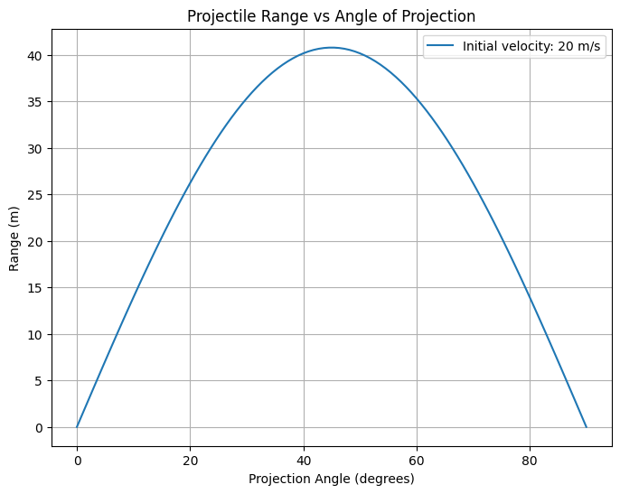

# Problem 1
Investigating the Range as a Function of the Angle of Projection
1. Theoretical Foundation
Projectile motion is governed by Newton’s laws and can be derived from basic principles. Let’s assume a projectile is launched with initial velocity $v_0$ at angle $\theta$, under gravitational acceleration $g$, with no air resistance.

Derivation of Equations
Split the initial velocity into components:

Horizontal: $v_{x0} = v_0 \cos\theta$
Vertical: $v_{y0} = v_0 \sin\theta$
Acceleration:

$a_x = 0$ (no horizontal force)
$a_y = -g$ (gravity acts downward)
Horizontal Motion

With constant velocity:
x
(
t
)
=
v
x
0
t
=
v
0
cos
⁡
θ
⋅
t
x(t)=v 
x0
​	
 t=v 
0
​	
 cosθ⋅t

Vertical Motion

Using the kinematic equation:
y
(
t
)
=
v
y
0
t
+
1
2
a
y
t
2
y(t)=v 
y0
​	
 t+ 
2
1
​	
 a 
y
​	
 t 
2
 
Substitute:
y
(
t
)
=
v
0
sin
⁡
θ
⋅
t
−
1
2
g
t
2
y(t)=v 
0
​	
 sinθ⋅t− 
2
1
​	
 gt 
2
 

Time of Flight

Set $y(t) = 0$ for ground-level launch:
0
=
v
0
sin
⁡
θ
⋅
t
−
1
2
g
t
2
0=v 
0
​	
 sinθ⋅t− 
2
1
​	
 gt 
2
 
Factorize:
t
(
v
0
sin
⁡
θ
−
1
2
g
t
)
=
0
t(v 
0
​	
 sinθ− 
2
1
​	
 gt)=0
Solutions: $t = 0$ or:
t
=
2
v
0
sin
⁡
θ
g
t= 
g
2v 
0
​	
 sinθ
​	
 
This is the time of flight, $T$.

Family of Solutions

The trajectory $x(t)$ and $y(t)$ depends on $v_0$, $\theta$, and $g$, forming a family of parabolic curves.

2. Analysis of the Range
The range $R$ is the horizontal distance at $t = T$:
R
=
v
0
cos
⁡
θ
⋅
2
v
0
sin
⁡
θ
g
R=v 
0
​	
 cosθ⋅ 
g
2v 
0
​	
 sinθ
​	
 
Using $2 \sin\theta \cos\theta = \sin(2\theta)$:
R
=
v
0
2
sin
⁡
(
2
θ
)
g
R= 
g
v 
0
2
​	
 sin(2θ)
​	
 

Angle Dependence
$\sin(2\theta)$ peaks at 1 when $2\theta = 90^\circ$, so $\theta = 45^\circ$.
Maximum range: 
R
m
a
x
=
v
0
2
g
 at 
θ
=
4
5
∘
R 
max
​	
 = 
g
v 
0
2
​	
 
​	
  at θ=45 
∘
 
At $\theta = 0^\circ$ or $90^\circ$, $R = 0$.
Parameter Effects
Initial Velocity ($v_0$): $R \propto v_0^2$, a quadratic relationship.
Gravity ($g$): $R \propto \frac{1}{g}$, inversely proportional.
3. Practical Applications
Sports: A basketball shot follows $R = \frac{v_0^2 \sin(2\theta)}{g}$.
Engineering: Cannon range optimization.
Uneven Terrain: For launch height $h$, solve: 
0
=
h
+
v
0
sin
⁡
θ
⋅
t
−
1
2
g
t
2
0=h+v 
0
​	
 sinθ⋅t− 
2
1
​	
 gt 
2
 
Air Resistance: Requires numerical solutions beyond this model.
4. Implementation
Here’s a Python simulation:

Graphical Representations
The plot peaks at 45°, showing $R$’s dependence on $\sin(2\theta)$. Changing $v_0$ scales the curve, while $g$ shifts its magnitude.

Limitations and Extensions
Limitations
No air resistance or wind.
Assumes flat terrain and constant $g$.
Extensions
Drag: Add $F_d = -k v^2$.
Wind: Modify $v_x$ with wind velocity.
Height: Adjust $y(t)$ for $h \neq 0$.